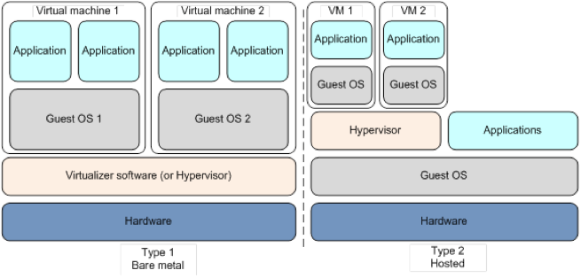
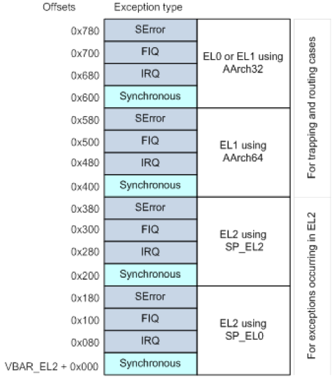

## hypervisor简介
操作系统内核的作用：
1. 再底层硬件上提供抽象层
2. 在多个用户空间应用程序分配调度，如执行时间、内存、内存I/O
而`hypervisor`和操作系统的功能差不多，它不是托管多个应用程序，而是托管多个操作系统，它管理`supervisor`，被叫做`hypervisor`。
hypervisor创建的虚拟机和真机差不多。两种类型的`hypervisor`框架如下：


Type1是裸机`hypervisor`，每个vm都有一个guest操作系统，Xen使用Type1。这种机构效率高。
Type2中`hypervisor`是在host OS之上的，kvm使用Type2结构。这种结构中，`hypervisor`相当于安装在host OS的应用程序，具有良好的硬件兼容性。但是这种结构十分耗硬件资源，并且因为不是直接访问硬件，效率也没有Type1高。
`hypervisor`带操作系统的内存简易布局如下：

客户机内核层将应用的虚拟地址映射到内核上，然后内核将这个地址转成hypervisor层的物理地址。Type2架构的虚拟机管理中，在客户机看来的`hypervisor`的物理地址空间对于主机来讲是主机hypervisor应用程序的虚拟内存空间。

## aarch64 hypervisor
64位Arm架构分了以下特权级（EL是`Exception Level`的缩写）：
- EL0: 用户空间应用
- EL1: 操作系统内核
- EL2: hypervisor
- EL3: 固件或者trust zone
Arm处理器重置后从EL3开始执行，并且在最高级别上MMU、缓存、异步异常都被禁用
当EL2中的管理程序代码在AArch64中执行时，可以使用专用寄存器，包括：
异常返回状态寄存器：`SPSR_EL2`和`ELR_EL2`，堆栈指针：`SP_EL2`（和SP_EL0）。
通过特殊指令`HVC（Hypervisor Call）`可以进入EL2。Arm的Hypervisor功能十分丰富。

### 内存管理
主流的操作系统都包含内存管理的功能，管理操作系统内存和应用程序上的内存。Hypervisor负责管理它自己的内存和运行在它之上的客户机操作系统内存，它用MMU来进行地址转换。
安装向量表：
```asm
ADR X0，vector_table
MSR VBAR_EL2，X0
```

向量表的结构如下：



除了建自己的转换表，也要给每个客户机建一个转换表。
```assembly
// Init VM1
//
.global Image$$VM1_TT_S2$$ZI$$Base
MOV      X0, XZR                               // Reset address: 0x0
MOV      X1, #0                                // Execution state: AArch32
MOV      X2, #0xC0000000                       // Physical memory for VM
LDR      X3, =vm1                              // Data structure of VM context
LDR      X4, =Image$$VM1_TT_S2$$ZI$$Base       // Load address of second stage 
                                               // first level table
LDR      X5, =0x80010203                       // Affinity: 0.1.2.3
LDR      X6, =0x411FD073                       // MIDR: Cortex-A57
BL       init_vm
// HCR_EL1
MOV      X8, #1                                // VM==1: Second stage 
                                               // translation enable
ORR      X8, X8, #(0x7 << 3)                   // Set FMO/IMO/AMO => physical 
                                               // async exceptions routed to 
                                               // EL2
ORR      X8, X8, X1, LSL #31                   // RW: based on passed in args
STR      X8, [X3]
MSR      HCR_EL2, X8
```
可以看到通过`HCR_EL2`寄存器进行设置。
在如下结构中，`TTBRn_EL1`被上面的代码设置

`TTBRn_EL1`转`ELF0/1`为中间地址，然后再由VTTBR_EL2转成最终的物理地址。而`EL2`是可以直接转成物理地址的。

### 设备仿真
hypervisor中，设备房子基于内存。客户机访问设备需要通过访问特定的内存，在访问该内存时，至少要经过stage2的转换。转换完成后，hypervisor检查对设备的方法是否合法，若合法，载访问真实物理设备或者虚拟出来的设备返回信息给客户机。当客户机向设备传递数据的时候，hypervisor会产生虚拟IRQ中断，模拟访问硬件设备寄存器（其实就是定义和硬件一样的规则，返回预期的寄存器值）

### 设备分配
将具体的硬件设备直接分配给客户机，不做中间映射，这样就能省去设备仿真时候的资源消耗。

### 异常处理
AArch64异常向量表包含四个块，使用哪个块取决于运行在EL0/EL1还是EL2

### 指令陷阱
除了捕获异常外，还可以将hypervisor配置成捕获特定的指令，通常是因为这些指令带了要进行地址转换的虚拟地址，通过HCR_EL2设置。捕获成功后，可以通过读异常综合寄存器ESR_EL2来获取捕获指令的信息。
通常，可以捕获以下类型指令：
内存控制寄存器：TTBRn和TTBCR；
系统指令：cache或者TLB维护指令；
辅助控制寄存器：ACTLR_EL1；
ID寄存器；
WFE和WFI说明：当客户机进入低功率的时候，更改正在运行的客户机OS

### 虚拟异常
ARMv8-A支持三个虚拟异常：SError、虚拟IRQ、虚拟IFQ。他们是由hypervisor制造的异常，可以仿真没有真实产生的物理异常。这些也都是通过HCR_EL2设置。虚拟机通过虚拟CPU接口和专用HCR位发出信号，当以这种异常发出的时候，PASTATE A, I, F不屏蔽物理异常，而是屏蔽客户机的物理异常
EL2和EL3时候，会始终屏蔽虚拟异常。


### 上下文切换
hypervisor在一个核心上调度另外一个，需要将当前的上下文保存到内存当中，然后从内存恢复另外一个虚拟机的上下文。包括：
- 通用寄存器及所有模式模式下的存储寄存器；
- 用来进行访问控制和内存管理的系统寄存器；
- 中断和挂起活动的信息；
- 对于有专用定时器的客户机，需要保存其定时器。
而分配给虚拟客户机的物理内存，不需要保存。

### 内存转换
在这里内存转换是基于内存表进行的。在EL0和EL1上时，转换由操作系统进行控制。没有虚拟化的系统中，该机制用于将虚拟地址转成物理地址；在有虚拟化的机子中，该机制用于转虚拟地址为中间物理地址（IPA），然后IPA还要经过stage2的转换

stage2使用的寄存器是VTTBR_EL2和VTCR_EL2，由hypervisor控制。
ARMv8-A虚拟化引入(VM)ID的概念，每个虚拟机分配一个VMID，存储在VTCR_EL2中，是一个8位的值。对于访客控制，MMU在TLB有完整的VAIPAPA的转换条目，VMID保证了只有正确的VMID对应的虚拟机才能正常访问对应的TLB条目。

## example

```assembly
.data
hello_world:
    .ascii "Hello, world!\0"
globalfunc entry2
    ADRP    x0, dummy_vectors
    MSR     VBAR_EL2, x0
    ADRP    x0, _stack_start
    MOV     sp, x0
    BL      pl011_init
    ADR     x0, hello_world
    BL      pl011_puts
    B       .
endfunc entry2
```

## Reference

- [aarch64 hypervisor official doc](https://developer.arm.com/docs/100942/latest/hypervisor-software)
- [aarch64 helloworld](https://ashw.io/series/arm64-hypervisor-tutorial)
- [arm64 hypervisor tutorial](https://github.com/ashwio/arm64-hypervisor-tutorial)
